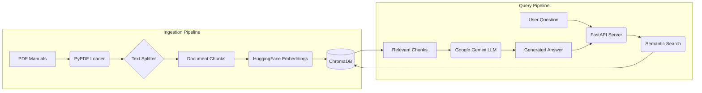

# 🏍️ Bike Manual RAG System

A **Retrieval-Augmented Generation (RAG)** application for querying motorcycle owner's manuals using natural language. Ask questions about your bike, and the AI will retrieve relevant information from your PDF manuals and provide accurate, context-aware answers.


---

## ✨ Features

-   **📄 Smart PDF Ingestion**: Automatically processes and chunks PDF manuals with metadata extraction.
-   **🔍 Semantic Search**: Uses state-of-the-art embeddings (`all-mpnet-base-v2`) for accurate document retrieval.
-   **🤖 AI-Powered Answers**: Leverages Google Gemini for generating human-like responses grounded in your documents.
-   **💻 Web Interface**: A clean, modern UI inspired by Google NotebookLM for easy interaction.
-   **📊 Context Adherence Score**: Each answer includes a score indicating how much it relies on the provided documents vs. general knowledge.

---

## 🏗️ Architecture



---

## 🛠️ Tech Stack

| Component        | Technology                                     |
| :--------------- | :--------------------------------------------- |
| **Framework**    | LangChain                                      |
| **LLM**          | Google Gemini (`gemini-2.5-flash-lite`)        |
| **Embeddings**   | HuggingFace (`all-mpnet-base-v2`)              |
| **Vector Store** | ChromaDB                                       |
| **Backend**      | FastAPI, Uvicorn                               |
| **Frontend**     | HTML, CSS, JavaScript                          |

---

## 🚀 Getting Started

### Prerequisites

-   Python 3.10 or higher
-   A Google AI API Key ([Get one here](https://makersuite.google.com/app/apikey))

> [!NOTE]
> **Why do you need an API key?**  
> This project uses **Google Gemini** (a large language model) to generate human-like answers based on the retrieved document context. The API key authenticates your requests to Google's AI service. The key is **free** for personal use within generous rate limits.

### Installation

1.  **Clone the repository:**
    ```bash
    git clone https://github.com/YOUR_USERNAME/bike-rag.git
    cd bike-rag
    ```

2.  **Create a virtual environment:**
    ```bash
    python -m venv venv
    # On Windows
    .\venv\Scripts\activate
    # On macOS/Linux
    source venv/bin/activate
    ```

3.  **Install dependencies:**
    ```bash
    pip install -r requirements.txt
    ```

4.  **Set up your API Key:**
    -   Create a `.env` file in the project root by copying the example:
        ```bash
        cp .env.example .env
        ```
    -   Open `.env` and replace `your_google_api_key_here` with your actual API key.

5.  **Add your PDF manuals:**
    -   Create a `bike_manuals` folder in the project root.
    -   Place your motorcycle owner's manual PDFs inside this folder.

---

## 📖 Usage

### 1. Ingest Manuals

Run the ingestion script to process your PDFs and build the vector database:

```bash
python ingest_manuals.py
```

This will create a `chroma_db` folder containing the vector embeddings.

### 2. Run the Application

Start the FastAPI server:

```bash
python server.py
```

Or use Uvicorn directly:

```bash
uvicorn server:app --reload
```

### 3. Open the UI

Navigate to `http://localhost:8000/static/index.html` in your browser.

---

## 📁 Project Structure

```
bike-rag/
├── .env.example          # Template for environment variables
├── .gitignore            # Files to exclude from Git
├── ingest_manuals.py     # Script to process PDFs and build vector DB
├── rag_retrieval.py      # Core RAG logic (retrieval + generation)
├── server.py             # FastAPI backend server
├── requirements.txt      # Python dependencies
├── run_app.bat           # Windows batch script to run the app
└── static/
    ├── index.html        # Main UI page
    ├── style.css         # Styles for the UI
    └── script.js         # Frontend JavaScript logic
```

---

## 🤝 Contributing

Contributions are welcome! Feel free to open an issue or submit a pull request.

---

## 📜 License

This project is open-source and available under the [MIT License](LICENSE).
